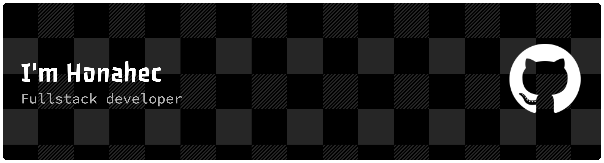

---

**I'm currently...**

- 👨‍💻 Member of [GeekPie Association](https://github.com/ShanghaitechGeekPie/)
- 🎓 Studying at **ShanghaiTech University**
- 💡 Majoring in **Computer Science**
- 🎈 Also interested in Full-Stack Developing & UI/UX
- 🌐 Learn more at [My Homepage](https://honahec.cc/) or [My Blog](https://blog.honahec.cc)

---

<picture>
  <source
    srcset="https://github-readme-stats.vercel.app/api?username=Honahec&hide_title=false&hide_rank=false&show_icons=true&include_all_commits=true&count_private=true&disable_animations=false&theme=dark&locale=en&hide_border=false&line_height=24"
    media="(prefers-color-scheme: dark)"
  />
  
</picture>
<picture>
  <source
    srcset="https://github-readme-stats.vercel.app/api/top-langs?username=Honahec&locale=en&hide_title=false&layout=compact&card_width=320&langs_count=8&theme=dark&hide_border=false&line_height=24"
    media="(prefers-color-scheme: dark)"
  />
  
</picture>

###

###

<picture></picture>

###

  <!--
  --><!--
  --><!--
  -->

 

<picture>
  <source media="(prefers-color-scheme: dark)" srcset="https://raw.githubusercontent.com/Honahec/Honahec/output/snake-dark.svg" />
  <source media="(prefers-color-scheme: light)" srcset="https://raw.githubusercontent.com/Honahec/Honahec/output/snake.svg" />
  
</picture>
